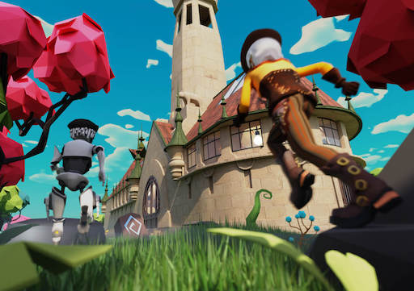

# Finnish Meta Gallery

The Finnish Meta Gallery was the first Finnish museum to open an exhibition space in the metaverse in October 2022. 



## Description

This scene demonstrates

- How to add external links
- How to handle click events on an entity
- How to play animations from a 3D model
- How to use trigger areas to play audio, display custom UI, interact with NPC
- How to use the NPC Utils library to create a Non-Player Character
- How to fetch the player's UserId and send HTTP requests to an API to store it
- How to optimise a scene with lazy loading mechanics
- How to track player position and rotation

# Decentraland scene

This folder contains all the necessary files to launch a Decentraland scene.

## Try it out

**Install the CLI**
``
Download and install the Decentraland CLI by running the following command:

```bash
npm i -g decentraland
```

**Previewing the scene**

Open this folder on the command line, then run:

```
dcl start
```

Any dependencies are installed and then the CLI opens the scene in a new browser tab.


## Copyright info

This scene is protected with a standard Apache 2 licence. See the terms and conditions in the [LICENSE](/LICENSE) file.

